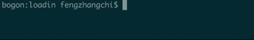

# Loadin

> **A very very simple way to apply terminal-animation to your function!**

> **RECOMMEND:** This project should not be used in serious software. Take it as a toy :)

## Setup ##

    pip install loadin

## Usage ##
ALL YOU NEED is ONE-LINE:

    @loading('download some files')
    def download():
        time.sleep(3)

    if __name__ == '__main__':
        download()

OR more animation:

	from loadin import loading

    @loading(style='wave', tips='download some files', end_flag=False, speed='fast')
    def download():
        time.sleep(3)

    @loading('download')
    def save():
        for i in range(3):
            time.sleep(1)

It's DONE!

## Args ##

- **tips**: tips you want to show in terminal 
> any string, can't be empty
- **style**: style of animation
> 'point', 'cycle', 'wave'
- **end_flag**: if True, 'Done' will be showed at the end of your function 
> True or False
- **speed**: animation speed
> 'fast', 'normal' or 'slow'

## How it works? ##

- Build a process to refresh your terminal.
- For detail, you can view the code directly.

## Bug ##

Pull requests, issues, comments and suggestions welcome.
